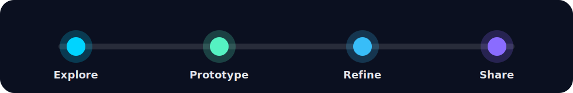

[简体中文](./README.md) | [English](./README.en.md)

<a href="https://github.com/wintopic">Profile</a>
·
<a href="https://github.com/wintopic?tab=repositories">Projects</a>
·
<a href="https://github.com/wintopic?tab=followers">Followers</a>

## About Me

Hi, I'm **wintopic**. I enjoy exploring practical technology, building lightweight tools, and turning scattered ideas into projects that actually run.

- Focusing on AI-assisted workflows, automation, and full-stack experiments.
- Keeping projects clear, lightweight, and easy to iterate.
- Learning in public through code, notes, and reusable demos.
- Open to interesting ideas, collaboration, and thoughtful technical conversations.

## Tech Toolbox

## Live Snapshot

[Lightwell](https://github.com/wintopic/Lightwell) · [Codex-Desktop-Linux](https://github.com/wintopic/Codex-Desktop-Linux) · [ClearMint](https://github.com/wintopic/ClearMint) · [Android-Studio-ZH](https://github.com/wintopic/Android-Studio-ZH) · [gnome-topline](https://github.com/wintopic/gnome-topline)

## Current Direction

I like projects that make daily work smoother: small automations, clean interfaces, AI-enhanced tools, and learning notes that help the next person move faster.

## Find Me

