[简体中文](./README.md) | [English](./README.en.md)

<a href="https://github.com/wintopic">主页</a>
·
<a href="https://github.com/wintopic?tab=repositories">项目</a>
·
<a href="https://github.com/wintopic?tab=followers">关注者</a>

## 关于我

你好，我是 **wintopic**。我喜欢探索实用技术，做轻量但有用的工具，把零散想法整理成真正可以运行、可以复用的项目。

- 关注 AI 辅助工作流、自动化工具和全栈实验。
- 喜欢清晰、轻量、易迭代的项目结构。
- 通过代码、笔记和 Demo 持续学习与公开沉淀。
- 欢迎有趣的想法、协作机会和真诚的技术交流。

## 技术工具箱

## 动态概览

[Lightwell](https://github.com/wintopic/Lightwell) · [Codex-Desktop-Linux](https://github.com/wintopic/Codex-Desktop-Linux) · [ClearMint](https://github.com/wintopic/ClearMint) · [Android-Studio-ZH](https://github.com/wintopic/Android-Studio-ZH) · [gnome-topline](https://github.com/wintopic/gnome-topline)

## 当前方向

我更偏爱能让日常工作更顺手的项目：小型自动化、干净的界面、AI 增强工具，以及能帮助后来者更快上手的学习记录。

## 找到我

