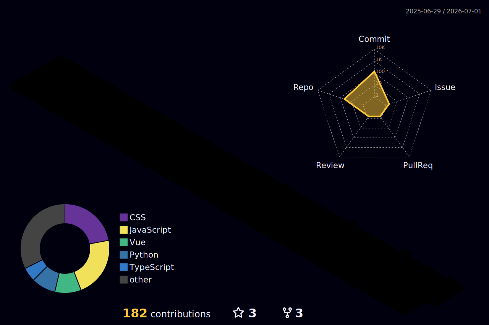
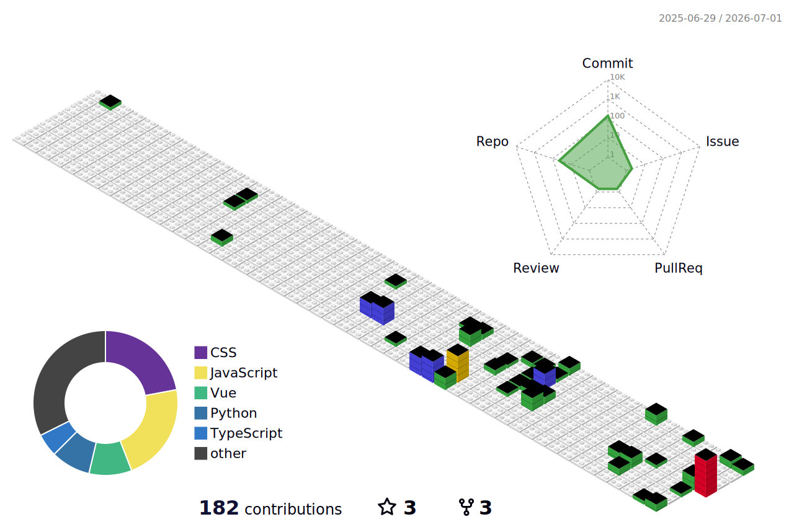
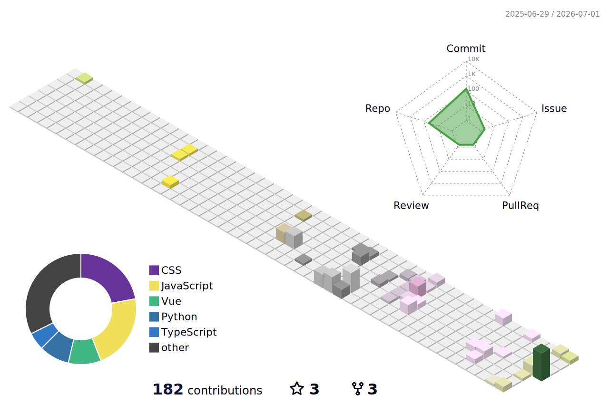
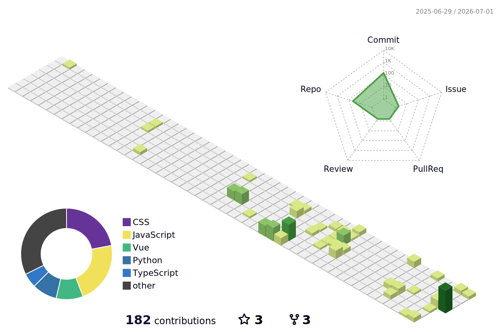
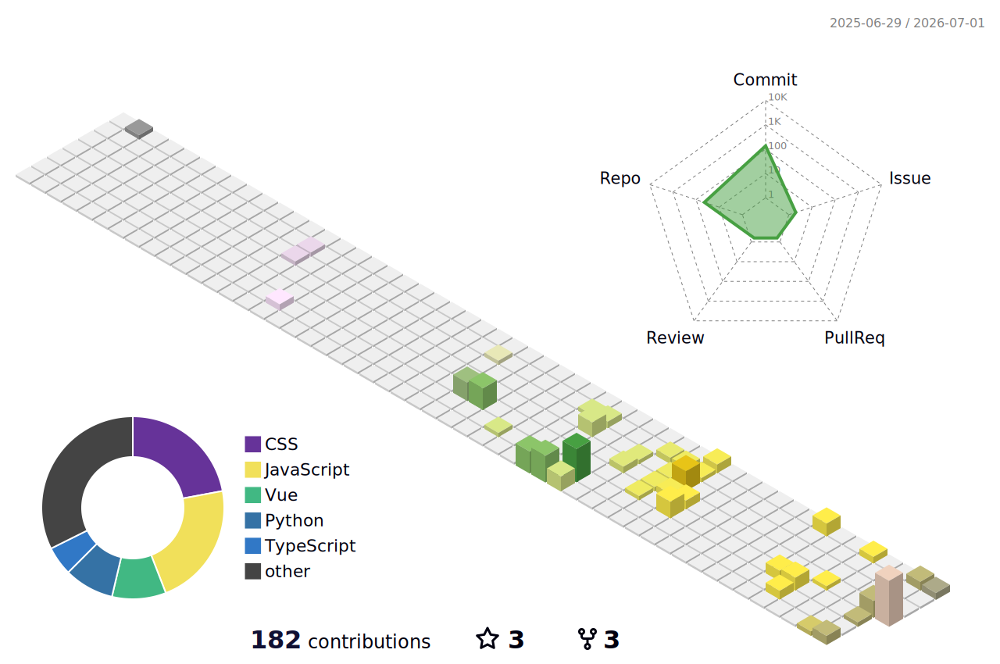
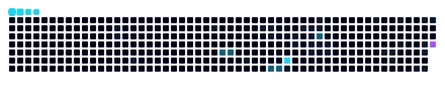

[简体中文](./README.md) · [English](./README.en.md)

 

<table>
  <tr>
    <td width="50%"></td>
    <td width="50%"></td>
  </tr>
  <tr>
    <td width="50%"></td>
    <td width="50%"></td>
  </tr>
</table>

<table>
  <tr>
    <td><strong>ORBIT</strong></td>
    <td><strong>SIGNAL</strong></td>
    <td><strong>BUILD</strong></td>
    <td><strong>FLOW</strong></td>
  </tr>
</table>

